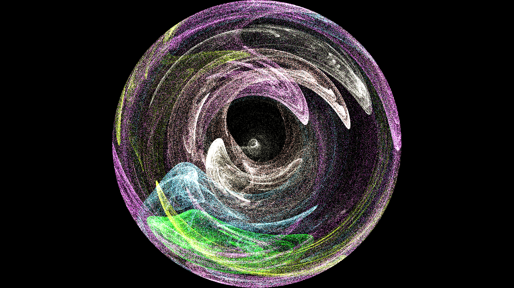
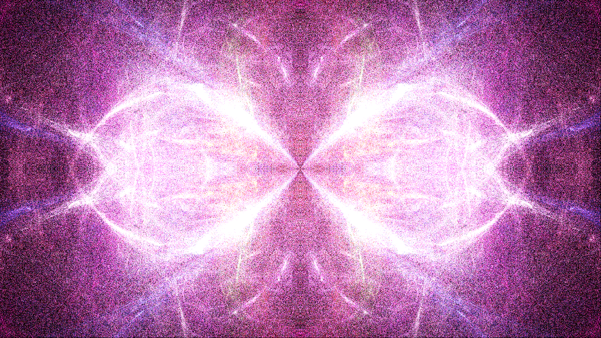
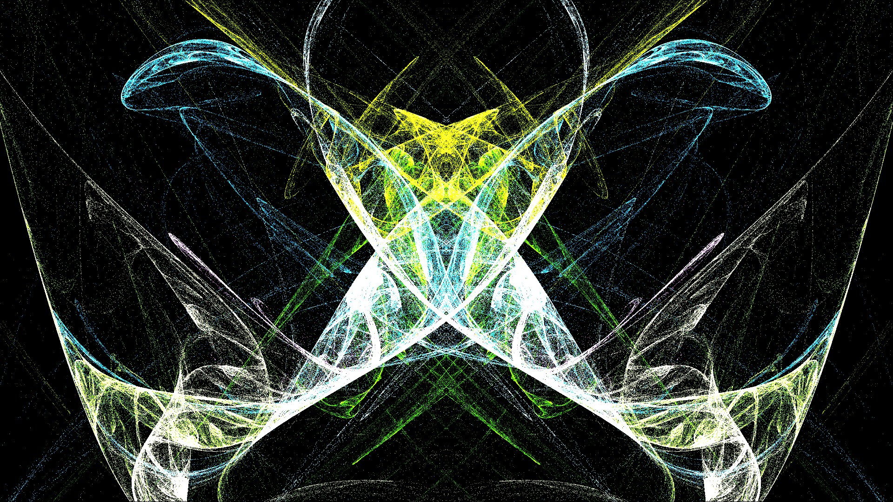
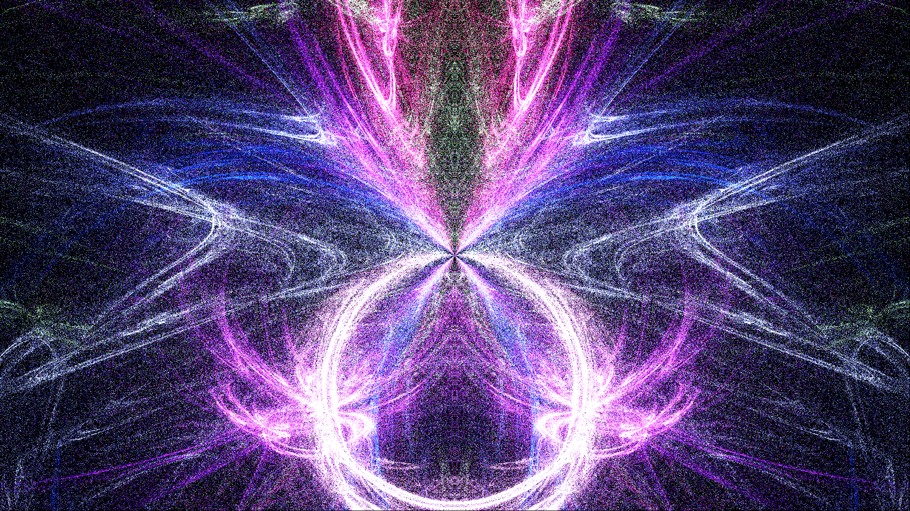
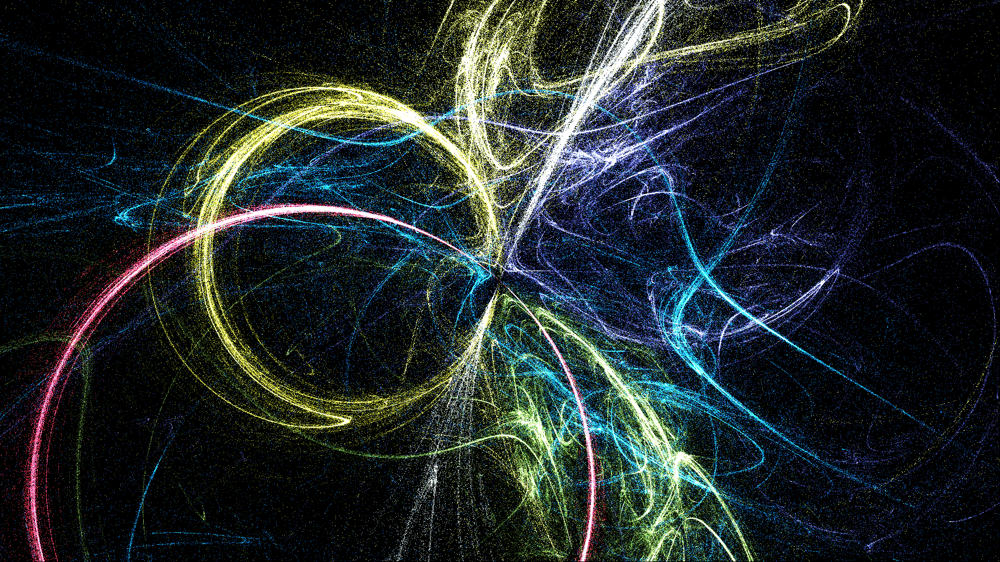
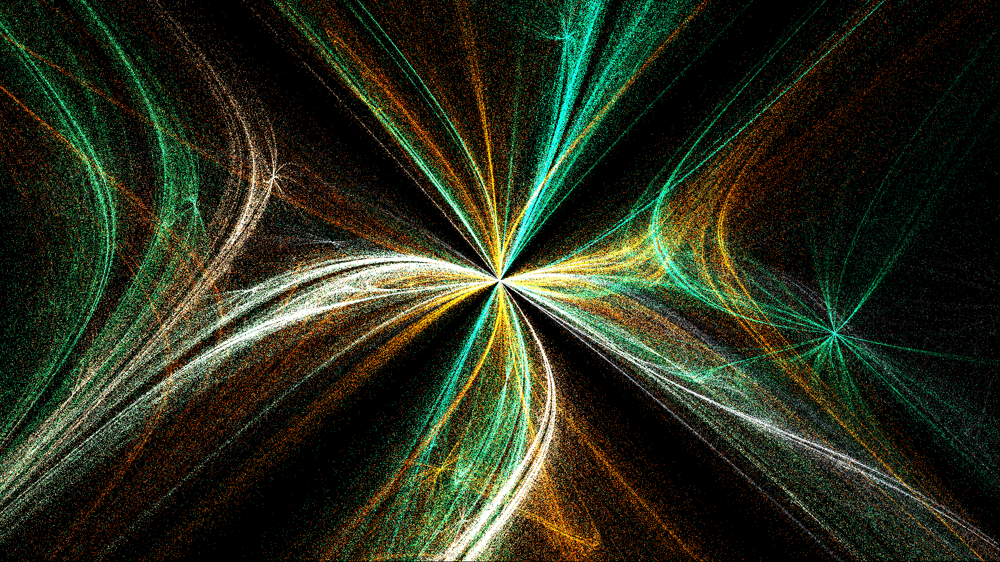

## Описание
В проекте нужно реализовать алгоритм генерации изображения фрактального пламени, основанного на идее Chaos Game. Требуется реализовать однопоточную и многопоточную версию программы.

## Примеры изображений

## Функциональные требования
Реализация цветного алгоритма генерации фрактального пламени.
Возможность запуска как в однопоточном, так и в многопоточном режиме.
Настройка параметров генерации: размер изображения, количество итераций, набор трансформационных функций и т.д.
Хотя бы 4 трансформации из оригинальной статьи.

## Нефункциональные требования
Программа должна легко конфигурироваться.
Многопоточная реализация должна работать быстрее однопоточной.
Опубликованы сравнительные результаты времени работы:
Конфигурация системы,
Время работы,
Количество используемых потоков

## Описание входных и выходных данных
### Ввод
Размеры изображения (ширина и высота).
Количество итераций для генерации фрактала.
Список трансформационных функций и их параметры.
### Вывод
Изображение фрактального пламени.

### Инструкции по реализации
Изучите теоретическую часть алгоритма для генерации фрактального пламени.
Реализуйте базовую однопоточную версию алгоритма с заданными параметрами.
Переведите однопоточную версию в многопоточную.
Добавьте конфигурацию для изменения числа потоков и других параметров генерации.

## Тестирование
Проверьте корректность работы алгоритма на различных наборах параметров.
Проверьте корректность и напишите тесты для ваших трансформаций.
Выполните сравнение производительности однопоточной и многопоточной версий, измерив время выполнения.
Убедитесь, что реализация многопоточной обработки действительно ускоряет процесс генерации изображения.

## Ограничения и советы
Совет: убедитесь, что начальная реализация программы работает корректно, прежде чем переходить к многопоточности.
Совет: используйте профилировщик или отладочные замеры скорости для поиска узких мест.

## Дополнительные материалы
    Описание фрактального пламени:
    https://en.wikipedia.org/wiki/Fractal_flame
    https://habr.com/ru/articles/251537
    Оригинальная статья (+ каталог вариаций): https://flam3.com/flame_draves.pdf
    Что такое Chaos Game:
    https://en.wikipedia.org/wiki/Chaos_game
    https://beltoforion.de/en/recreational_mathematics/chaos_game.php
    Описание СИФ с нуля: https://proproprogs.ru/fractals
    Онлайн демо: https://tariqksoliman.github.io/Fractal-Inferno

## Критерии оценки
За задание можно получить 120 баллов.

- +10 бонусных баллов, если реализуете 5 и более трансформаций
- +10 бонусных баллов, если реализуете поддержку логарифмической гамма-коррекции
- +10 бонусных баллов, если вы добавите поддержку параметра симметрии
- +10 бонусных баллов, если вы поделитесь вашим результатом в чате группы и вам поставят лайк
